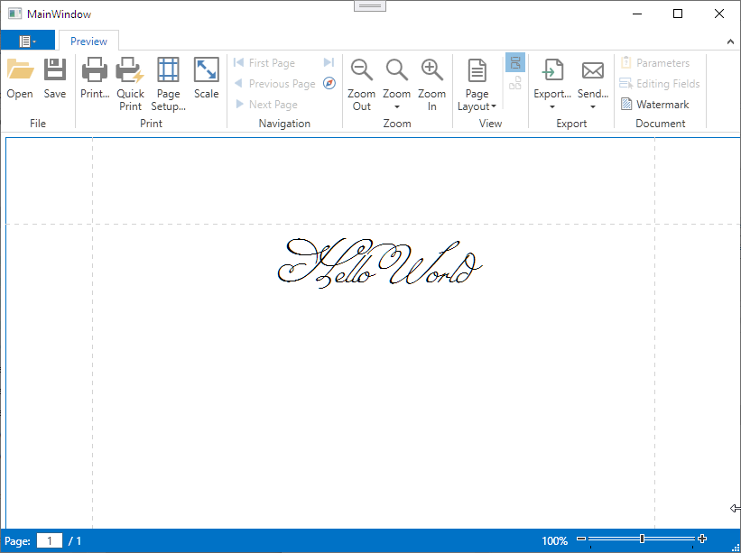

<!-- default badges list -->

<!-- default badges end -->
# Reporting for WPF - How to Use a Custom Font Distributed With the Application

The main idea of this approach is to use the [DXFontRepository](https://docs.devexpress.com/CoreLibraries/DevExpress.Drawing.DXFontRepository) instance to store custom fonts. The report constructor creates a new font and a [XRControlStyle](https://docs.devexpress.com/XtraReports/DevExpress.XtraReports.UI.XRControlStyle) report style based on the newly created font. The new custom style is added to the [XtraReport.StyleSheet](https://docs.devexpress.com/XtraReports/DevExpress.XtraReports.UI.XtraReport.StyleSheet) collection.

## Files to Look At

* [MainWindow.xaml](./CS/PrivateFontDemo/MainWindow.xaml)
* [MainWindow.xaml.cs](./CS/PrivateFontDemo/MainWindow.xaml.cs) (VB: [MainWindow.xaml.vb](./VB/PrivateFontDemo/MainWindow.xaml.vb))

## Documentation

- [DevExpress.Drawing Graphics Library](https://docs.devexpress.com/CoreLibraries/404247/devexpress-drawing-library)
- [DXFontRepository](https://docs.devexpress.com/CoreLibraries/DevExpress.Drawing.DXFontRepository)

## More Examples

- [Reporting for Web - How to Use a Custom Font Distributed With the Application](https://github.com/DevExpress-Examples/reporting-use-a-custom-font-distributed-with-the-application)
<!-- feedback -->
## Does this example address your development requirements/objectives?

 

(you will be redirected to DevExpress.com to submit your response)
<!-- feedback end -->
